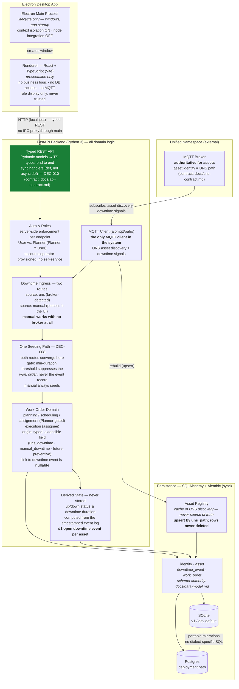

# CMMess — Proposed Architecture (temp doc)

> **Temporary, and derived — not an authority.** Rendered from
> `docs/architecture-facts.md`, `docs/functional-spec.md`, `docs/data-model.md`, and
> DEC-004–010 for the Senior Architect. Not part of the living-doc set; safe to
> delete. **If this diagram disagrees with any of those documents, they are right and
> this is stale** — one area, one authority doc.
>
> Current as of 2026-07-22, after the functional spec was approved and
> `data-model.md` authored. Built so far: backend `GET /health` (T-001); the renderer
> shell + CI land with T-002. Everything else is proposed.

**Legend:** green = exists today (T-001: `GET /health` through a typed Pydantic
model). The renderer shell and CI land with T-002; the four tables with T-003.
Everything else is proposed, constrained by `docs/architecture-facts.md`.

**The foundational decisions (DEC-004–010):** separate-service topology (Electron
shell + local FastAPI service, plain REST — no IPC data path) · server-side role
enforcement (a hidden button is not an access control) · SQLAlchemy + Alembic
dual-engine persistence (SQLite→Postgres without refactor) · live-broker UNS
(backend is the sole MQTT client; UNS authoritative for assets) · two downtime
ingress routes converging on **one** seeding path, with the work-order→event link
deliberately nullable so preventive maintenance stays additive · v1 ships both
ingress routes plus real auth · synchronous SQLAlchemy with `def` handlers.

**Three things this diagram exists to make visible**, because each is easy to build
wrong and expensive to unwind:

1. **The two ingress routes converge *before* seeding.** There is one piece of
   seeding logic; only how the event arrived varies. The manual route must work when
   the broker has published nothing.
2. **The gate is on seeding, not on recording.** A sub-threshold blip still logs its
   downtime event — the event log stays complete, so derived asset status and
   downtime history stay honest.
3. **The asset registry is rebuilt by upsert, never by truncate.** The UNS is
   authoritative for what exists *now*; it has no authority over what *happened*.
